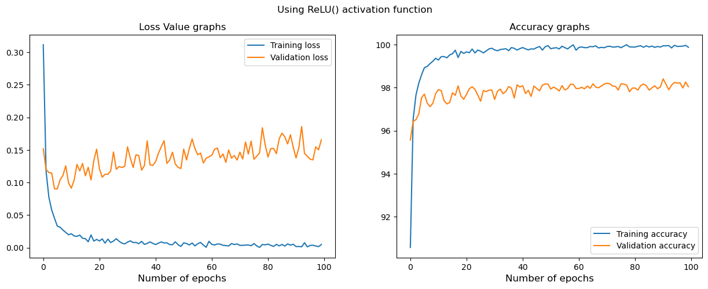
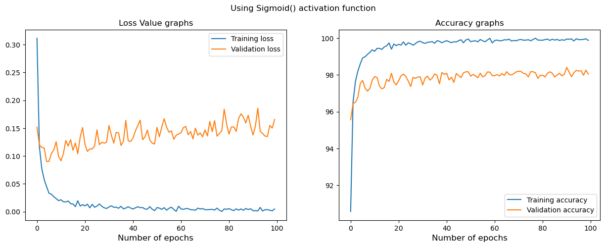

# MLP-for-Digit-recognition
Multi-layered Perceptron model with ReLU and Sigmoid activation function used to recognize digits via multiple-classification approach

* This model uses mnist_train_dataset and multiclass classification to recognize the digits from 0 to 9.
* The data is divided into train and validation datasets with a train size of 80%
* The model uses 100 epochs in the training phase

##Results
- Image 1:
  

- Image 2:
  
